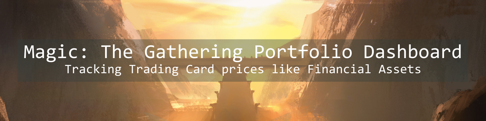

<p align="center">
  
</p>

# Magic: The Gathering Portfolio Dashboard


### Live Demo  
👉 [Explore the dashboard here](https://mtg-portfolio-dashboard.streamlit.app)


## 1. Introduction
Magic: The Gathering cards behave a lot like financial assets.

They have liquidity differences, multiple printings, condition-based pricing, supply shocks, reprints, speculation cycles, and long-tail volatility. Anyone who has tracked singles prices for more than a few months has intuitively experienced this.

This project started as a way to track my own MTG collection — but it was deliberately designed as something structurally close to a market portfolio tracker, rather than a hobby spreadsheet.

Instead of stocks or crypto, I chose MTG because the domain is more engaging, while the underlying engineering problems remain the same: reproducible pricing, historical snapshots, portfolio aggregation, and meaningful comparisons over time.

---

## 2. What This Project Does
This project implements an end-to-end portfolio tracking system that:
- Tracks a personal MTG collection from a CSV source of truth
- Fetches live card pricing from the Scryfall API
- Stores deterministic daily price snapshots in SQLite
- Computes total portfolio value over time
- Identifies top gainers and losers across configurable time windows
- Breaks down holdings by rarity and card type
- Presents everything in an interactive Streamlit dashboard

The result is not just a view of "current prices", but a reproducible historical portfolio.

---

## 3. Why MTG Instead of Traditional Markets
This project is intentionally domain-agnostic in structure.

MTG portfolios map cleanly to financial portfolios:
- Card printing → Ticker or instrument identifier
- Foil / non-foil → Share class or instrument variant
- Scryfall price → Market price
- Snapshot table → End-of-day pricing
- Collection CSV → Holdings ledger

With minor changes to the ingestion layer, this system could track equities, ETFs, or other traded assets.

---

## 4. High-Level Architecture
Data flows through the system as follows:
- `collection.csv` defines current holdings and quantities
- Prices are fetched from Scryfall and cached locally
- `snapshot_prices.py` records daily price snapshots into SQLite
- `dashboard_data.py` aggregates holdings, snapshots, and deltas
- Streamlit renders interactive portfolio views

Each layer has a single responsibility, mirroring production-style data pipelines.

---

## 5. Data Flow Overview
1. **Holdings** - Defined in collection.csv, acts as the single source of truth
2. **Ingestion** - Prices fetched from Scryfall, cached to avoid redundant API calls
3. **Storage** - Daily snapshots written to SQLite, enables historical reproducibility
4. **Analytics** - Joins holdings with snapshots, computes totals, deltas, and breakdowns
5. **Presentation** - Interactive dashboard with time-based controls

---

## 6. Dashboard Features
### Key metrics:
- Total portfolio value
- Number of positions tracked
- Latest snapshot date

### Visualizations:
- Portfolio value over time (daily, weekly, monthly)
- Top cards by position value
- Price movers (gainers and losers)
- Rarity-based breakdown
- Card-type breakdown

---

## 7. Project Structure
```
mtg-portfolio-dashboard/
    app.py                     # Streamlit entrypoint
    requirements.txt
    README.md

    data/
        collection.csv         # Holdings
        mtg_prices.sqlite      # Snapshot database

    scripts/
        _shared.py             # Common utilities
        snapshot_prices.py     # Price ingestion
        dashboard_data.py      # Analytics layer
        movers.py              # CLI movers analysis

    assets/
        banner.png
```

---

## 8. Running the Project Locally
### 1. Create and activate a virtual environment
```
python -m venv .venv
.venv\Scripts\activate
```

### 2. Install dependencies
```
pip install -r requirements.txt
```

### 3. Run the dashboard
```
streamlit run app.py
```

---

## 9. Deployment
The dashboard is hosted on Streamlit Cloud and is designed to:
- Run directly from GitHub
- Fetch and snapshot prices at runtime
- Update automatically when new snapshots are created
- Require no paid infrastructure

---

## 10. Why This Project Matters
This project demonstrates how to build a reproducible, snapshot-based portfolio system — not just a live-price viewer.

It reflects how real financial systems handle pricing, history, and aggregation, while using a domain that is engaging and personally meaningful.

The emphasis is on data integrity, structure, and clarity over novelty.

---

## 11. Future Improvements
- Support multiple collections or decks
- Add acquisition cost and PnL tracking
- Extend snapshot granularity controls
- Replace Scryfall with a pluggable pricing backend
- Adapt ingestion for traditional financial markets
